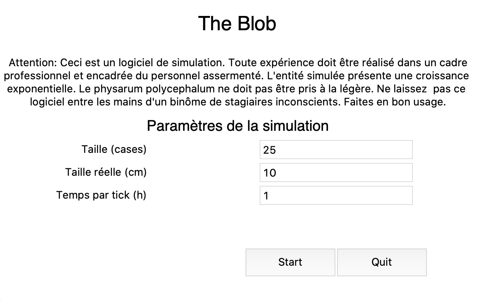
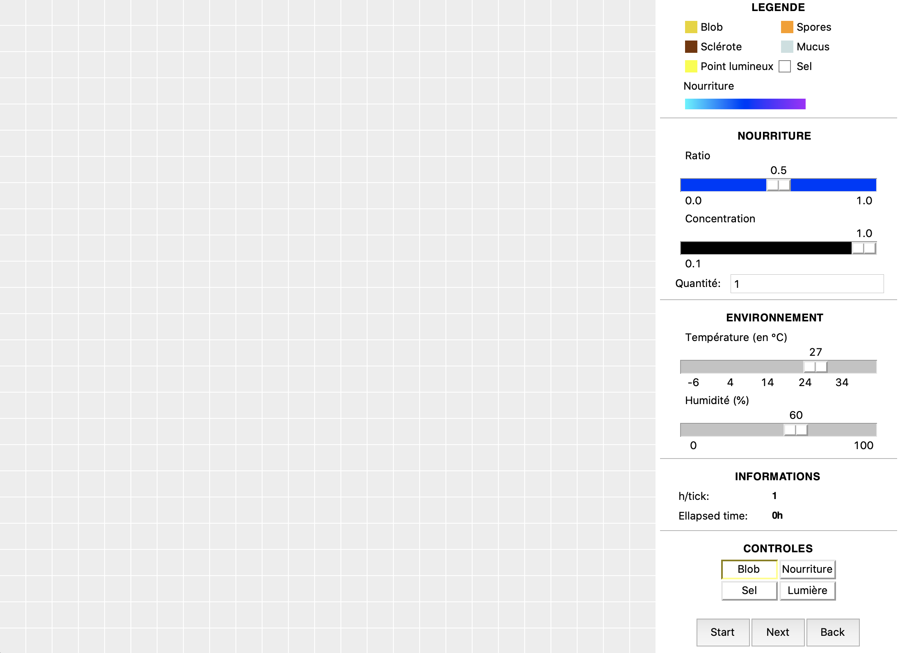
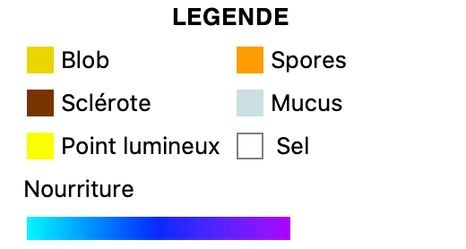
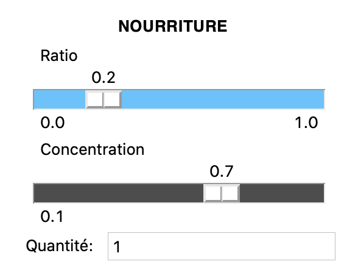
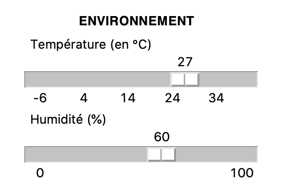
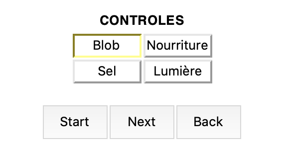

 # Rise of the Blob - Documentation

Bienvenue dans Rise of the Blob. Cette application vous permet de simuler différentes expériences impliquant physarum polycephalum.

## Installation

Ce projet a été développé sous Python 3.8.

Pour lancer le projet commencez par télécharger les dépendances nécessaires

 `$ pip install requirements.txt`

Lancez ensuite le fichier `main.py`

`$ python main.py`

### MacOs

Le dossier "dist" contient une version executable pour MacOs uniquement.

## Utilisation

### Menu d'accueil

 Cette fenêtre vous permet de gérer les paramètres principaux de la simulation:

 - La taille réelle
 - La taille en case
 - Le temps par tick

  

#### Taille réelle

La taille réelle représente la taille de l'environnement réel représenté dans la simulation.

#### Taille en case

La simulation utilise une grille pour représenter l'environnement. Cette grille est de taille $nxn$. Ici vous pouvez donc renseigner le nombre de case désiré.

 #### Temps par tick

 Un tick représente un tour de la simulation. Afin de gérer la vitesse et de tenir compte du temps écoulé, vous pouvez régler le nombre d'heures écoulées en un tour de la simulation. 

 ### Fenêtre principale

La fenêtre principale se compose de deux parties. A gauche l'environnement simulé et à droite le panneau de contrôle divisé en cinq sections.

  

#### Légende

La légende indique les couleurs des différents éléments qu'il est possible de retrouver dans la simulation:

 #### Paramètres de la nourriture

 La nourriture déposée dans la simulation est modélisée grâce à trois paramètres:

 - Un ratio qui représente la répartition protéines/glucides de la nourriture.
 - La concentration en nutriment de la nourriture.
 - La quantité de nourriture disponible

 La modification de ces paramètres change la couleur de la nourriture pour pouvoir distinguer les différentes sources. Le ratio fait varier la teinte, la concentration diminue la saturation.

 Le dernier paramètre est la quantité, vous pouvez l'inscrire dans la zone de texte dans la section nourriture.  A chaque tour, un Blob mange une quantité de 1 si il se trouve sur une source nutritive.

 #### Paramètres d'environnement

 Grâce aux slider de cette section, vous pouvez faire varier la température et l'humidité du monde simulé.

 #### Boutons d'ajout et de contrôle

 Vous pouvez utiliser le clic gauche pour déposer des éléments dans la simulation. Les quatre boutons d'ajout vous permettent de selectionner ce que vous voulez ajouter:

 - Un Blob
 - Une source de nourriture
 - Un point lumineux
 - Du sel

Le Bouton Start/Pause permet de démarrer et de mettre en pause la simulation. Le bouton Next permet d'effectuer un pas-à-pas (un tick).